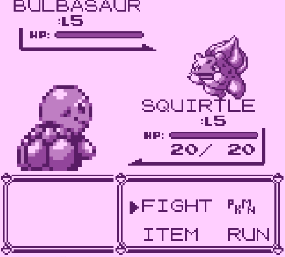

# natsukashii
### _"Joyful nostalgia"_
 
Rewrite of my GameBoy emulator in C++17 with ImGui and OpenGL (GLFW) 
It's shipped with a copyright-free, open source bootrom written by Optix: 
https://github.com/Hacktix/Bootix 

